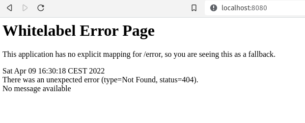
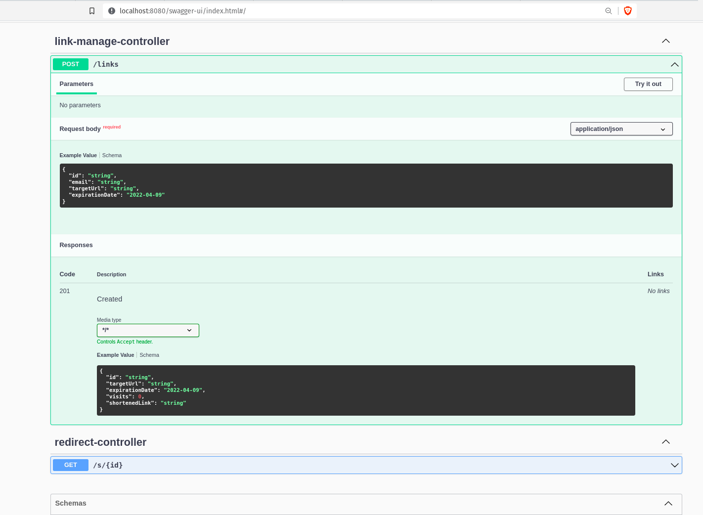
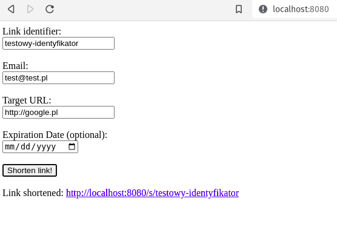
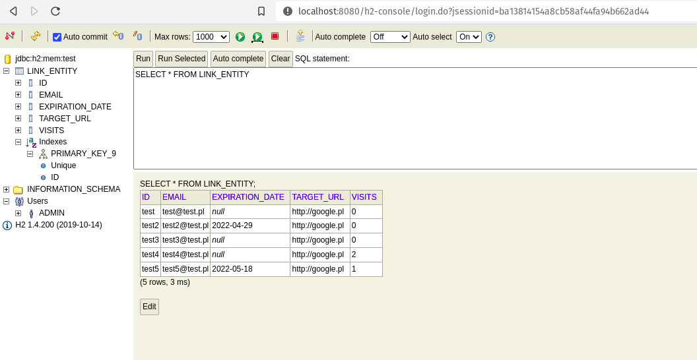
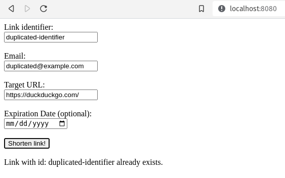
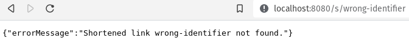
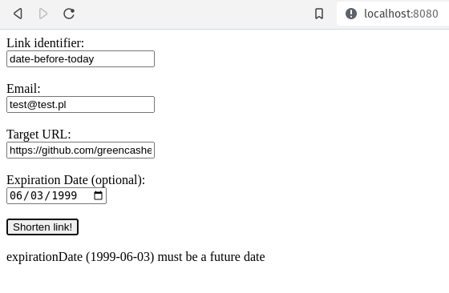

# Warsztaty Podstawy Springa

Zakres kursu obejmuje:

- Krótkie wprowadzenie do najnowszej wersji Javy
- Podstawy Spring Framework
  - Podstawy framework-a
  - Omówienie modułów
  - Dependency Injection / Inversion of Control
  - Podstawy Spring Boot
  - Właściwości (Properties)
- Tworzenie API
  - Tworzenie rest kontrolerów
  - Korzystanie z narzędzia od tworzenia dokumentacji OpenAPI (Swagger)
- Omówienie CRUD
- Integracja z Bazą danych
  - Spring Data JPA
  - Encje
  - H2 in memory sql database
  - Transakcyjność
- Lombok - minimalizacja boilerplate kodu
- Użycie Loggera
- Podstawy git (Tworzenie projektu, branching, tworzenie pull request-ów)
- Deployment aplikacji na Heroku

## Inicjalizacja lokalnego projektu

```Console
git clone https://github.com/greencashew/warsztaty-podstawy-springa.git
git submodule update --init --recursive
```

## Projekt Skracacz linków

Gotowy projekt: https://github.com/greencashew/spring-link-shortener

Katalogi **05.*** zawierają kolejne etapy tworzenia projektu w spring framework:

### 05.1-link-shortener-spring-with-heroku

#### Zmiany

- Wygenerowany projekt na stronie https://start.spring.io/
  - Dodane zależności:
    - Spring Web
    - Spring Data JPA
    - H2 Database
    - Lombok
    - Spring Boot DevTools
- Dodanie pliku _system.properties_ w celu poinformowania heroku w jakiej wersji javy ma uruchmić środowisko

#### Zachowanie

- Po uruchomieniu aplikacji w przeglądarce pod adresem http://localhost:8080/ powinna pojawić się następująca strona:



----

### 05.2-link-shortener-rest-controller-with-swagger

#### Zmiany

- Dodanie RestController-ów oraz Data Transfer Object-ów
- Dodanie zależności dokumentacji OpenAPI (Swagger) do **pom.xml**

```xml

<dependency>
  <groupId>org.springdoc</groupId>
  <artifactId>springdoc-openapi-ui</artifactId>
  <version>1.6.6</version>
</dependency>
```

Zachowanie:

- Po uruchomieniu aplikacji w przeglądarce pod adresem http://localhost:8080/swagger-ui/index.html powinna pojawić się
  strona swaggerUI, opisująca dostępne restowe endpointy:



- Wywołany endpoint powinien zwrócić wartości wpisane **na stałe w kodzie** kontrolerów.

----

### 05.3-link-shortener-service-layer

#### Zmiany

- Dodanie warstwy serwisu w pakiecie `link`
- Dodanie integracji z serwisem w kontrolerach
- _LinkDto_ został przeniesiony do katalogu **api**
- Została dodana HashMap-a zamiast bazy danych

#### Zachowanie

- Logika aplikacji na tym etapie powinna działać w następujący sposób:
  - Po utworzeniu linku skróconego strona przekierowania przenosi do właściwiej strony.
  - W przypadku wpisania niewłaściwego linku przekierowania powinien pojawić się stosowny komunikat
- Restart aplikacji skutkuje usunięciem się wszystkich utworzonych skróconych linków.

#### Zmiany do dodania

- Zablokowanie dodawania linków o takim samym identyfikatorze (aliasie)
- Obsługa wyjątków
- Napisanie testów serwisu

----

### 05.4-link-shortener-basic-frontend

#### Zmiany

- Dodana prosta strona wyświetlająca formularz dodawania linku
  - Pola formularza są wysyłane w formacie json do backend-u

#### Zachowanie



### 05.5-link-shortener-db-integration

#### Zmiany

- W _LinkServiceImpl hashmap_-a została zastąpiona integracją z bazą danych
- Zostało utworzone repozytorium Spring Data _LinkRepository_ oraz encja _LinkEntity_
- w _application.properties_ została dodana konfiguracja bazy danych **H2**

#### Zachowanie

- Aplikacja jest w pełni funkcjonalna tak jak uprzednio
- Dodatkowo poprzez klienta webowego można sprawdzić, czy rekordy zostały dodane do bazy danych H2:
  - Klient dostępny pod adresem: http://localhost:8080/h2-console/
  - Dane dostępowe takie same jak w pliku _application.properties_



----

### 05.6-link-shortener-exception-handling-with-controller-advisor

#### Zmiany

- Dodanie obsługi wyjątków w kontrolerach (_GlobalControllerAdvisor_ i  _LinkManageControllerAdvisor_)
- Dodany globalny DTO do obsługi wyjątków (_ExceptionResponse_)
- Dodanie wyjątku _LinkAlreadyExistsException_

#### Zachowanie

- W przypadku próby dodania linku o tym samym identyfikatorze pojawia się następujący komunikat:



- W przypadku próby przekierowania linku o nieprawidłowym identyfikatorze pojawia się następujący komunikat:



----

### 05.7-link-shortener-bean-validation

#### Zmiany

- Dodana walidacja pól wewnątrz klas _CreateLinkDto_ oraz _LinkManageController_
- Dodana zależność w **pom.xml**:

```xml

<dependency>
  <groupId>org.springframework.boot</groupId>
  <artifactId>spring-boot-starter-validation</artifactId>
</dependency>
```

- Dodana obsługa wyjątku w _GlobalControllerAdvisor_

#### Zachowanie

- W przypadku podania daty wcześniejszej niż aktualna pojawia się następujący komunikat:



----

### 05-link-shortener-solved

#### Zmiany

- Dodanie pełnej implementacji pozostałych CRUD-owych operacji:
  - Usuwanie linku
  - Aktualizacja linku
  - Otrzymywanie danych o skróconym linku
- Utworzenie scheduler-a usuwającego przeterminowane skrócone linki
